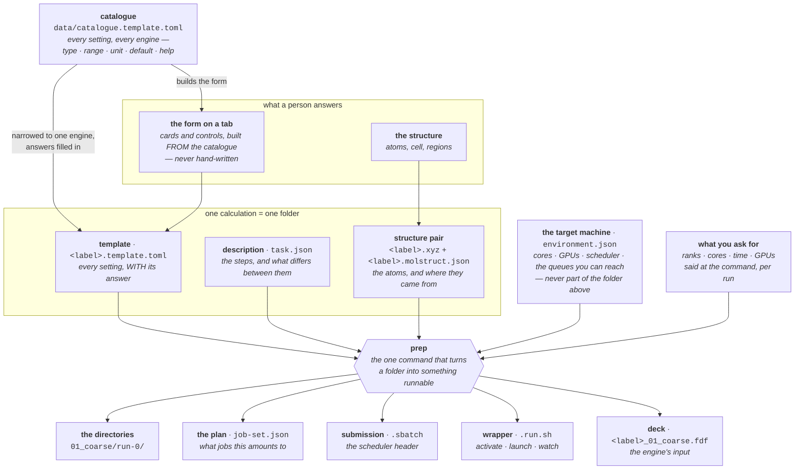
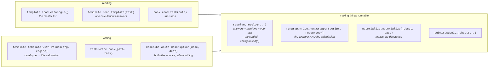
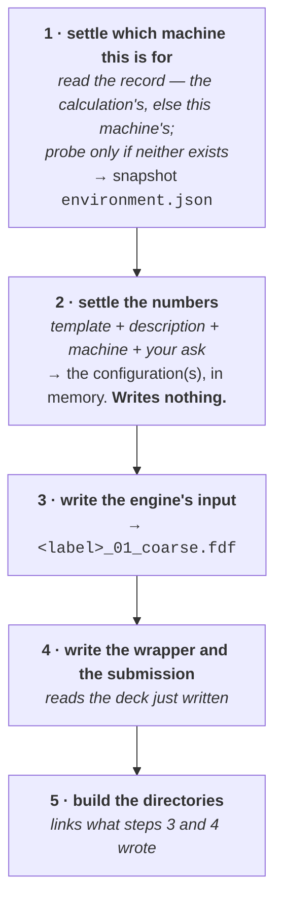

# How molbuilder works — what the parts are, and how they compose

**Role:** contract
**Domain:** (tree-wide)

**Companions — the contracts that own each part's internals, and where this
document and one of them disagree about a part's OWN rules, that one wins:**
[`engines/template.md`](?doc=engines/template.md) (the catalogue and the
template) · [`engines/stages.md`](?doc=engines/stages.md) (the description) ·
[`execution/generator.md`](?doc=execution/generator.md) (the pipeline's
mechanics) · [`execution/architecture.md`](?doc=execution/architecture.md) (who
owns which decision) ·
[`execution/job-contracts.md`](?doc=execution/job-contracts.md) (every file
format, and the shared vocabulary) ·
[`execution/project-layout.md`](?doc=execution/project-layout.md) (the
directories).

## 0. What this document owns

**It is the single contract for the WHOLE — what the parts are, and how they
work together.** Every part has a contract of its own that says what that part
*is* on the inside. Until this page existed, the sentence *"and here is how
they compose"* had no home, so it was written partly in four places and fully
in none.

| this document owns | it does not own |
|---|---|
| **which parts exist**, and the one name each is called by | what any one part contains — the settings an entry may carry, the keys a description may have |
| **what flows into what** — every arrow in § 3 | the format of the thing on either end of an arrow |
| **the doors** — that each file has one reader and one writer, and which they are | what those functions do internally |
| **the order**, and which step depends on which | the mechanics of any single step |
| **the invariants that only make sense across parts** — the machine never enters the portable folder; a door takes a whole object; two files made from one object are checked against each other | the reasoning behind each, which stays where it was argued |

**Two rules follow from that split, and they are what keep this document
true.**

> **R-W1 — this page states relationships, never restated details.** A fact
> that belongs to one part is named here and defined there. A second copy is a
> copy that drifts, and this project has paid for that twice: `stages.md` and
> `generator.md` came to contradict each other about where a benchmark's
> settings live, and a config class's help text drifted from the catalogue's.
>
> **R-W2 — a disagreement is a real defect, and which side is wrong depends on
> what is disagreed about.** If this page and a part's contract disagree about
> **that part's internals**, the part's contract wins. If they disagree about
> **how the parts compose**, this page wins and the other is the stale copy —
> that is the whole reason it exists.

**Plain language is a requirement here, not a courtesy.** This is the page a
person reads first, so a term is either an ordinary word or is defined in § 2
before it is used.

---

## 1. The one idea

**You describe a calculation in files. The program turns those files into more
files. Nothing anywhere is written for a particular engine except the one
function that knows how to write that engine's input.**

That is the whole design in a sentence, and everything below is what it costs
to mean it.

A worked feel for it: you want to relax a gold–molecule junction with SIESTA.
You never hand-write a SIESTA input. You answer questions about the
calculation — what basis, how fine a grid, how many k-points — and those
answers land in a file. Later, on whatever machine you happen to be on, a
command reads that file and writes the SIESTA input, the shell script that runs
it, and the scheduler submission next to it. **Change an answer, get a
different input file. You never edit the program.**

---

## 2. The vocabulary, defined once

Six words are used throughout. Each is ordinary once you know what it points at.

| word | in plain terms |
|---|---|
| **catalogue** | The master list of *every* setting molbuilder knows about, for every engine, with its type, its allowed range, its unit, its default and its help text. One file, hand-edited: `molbuilder/data/catalogue.template.toml` |
| **template** | One calculation's copy of that list, narrowed to the engine it will run on, with the answers filled in. Named `<label>.template.toml` |
| **description** | What *changes* across a calculation — the sequence of steps, and which settings differ between them. Named `task.json` |
| **deck** | The engine's own input file. `.fdf` for SIESTA, `.py` for PySCF. This is what the engine actually reads |
| **wrapper** | The shell script that activates the right environment, works out how many processors to use, launches the engine, and watches it. Named `<label>.run.sh` |
| **stage** | One step of a multi-step calculation — *coarse*, then *tight*. molbuilder's idea, not the engine's |

Two more you will meet in file names: an **attempt** is one try at running a
stage (`run-0`, `run-1`), and a **trial** is one point of a benchmark
(`bench-K16C1`).

---

## 3. The files, and how they relate

**Read this as: everything flows out of one hand-edited catalogue.**



### Why two files and not one

The template and the description look like they could be one file. They are
two because they answer different questions, and keeping them apart is what
makes a folder portable:

| | holds | changes when |
|---|---|---|
| **template** | *everything*, with the value in force — including the settings that vary, at their starting value | you change a setting |
| **description** | *which* of those you want to vary step by step, and each step's value | you add a stage, or promote a setting to vary |

So `mesh_cutoff` appears in both and says something different in each: the
template says **what it is**, the description says **that it steps, and to
what**. The rule and its reasoning are
[`stages.md § 6.2`](?doc=engines/stages.md).

### Why the machine is not in there

`environment.json` and the resources you ask for are deliberately **outside**
the folder above. That is what lets you hand the same folder to a colleague on
a different cluster, or benchmark it on a short queue and run it on a long one,
**without editing it**. The rule is
[`generator.md § 4.1`](?doc=execution/generator.md).

**A machine fact does not have to be detected — it has to be true.** You can
only probe the machine you are standing on, and the ordinary workflow is to
describe a calculation on your workstation for a cluster you are not on. So a
fact arrives **by probe when you are there and by declaration when you are
not**, and both are facts. What stays in `molbuilder.json` is not "the things
we could not detect" but **the things only you can answer** — which queue to
default to, which account to charge. The full split is
[`configuration.md § 5`](?doc=configuration.md) M-1.

**The folder says nothing about a machine at all** — not the ranks to use, and
not even the ranks to *try*. What to measure is said at the command, and it is
said **per stage**, because what runs fastest changes between a coarse step and
a tight one: different grid, different matrix, different best rank count. So
you measure one stage, and that stage's next run is offered what the
measurement found ([`generator.md § 4.3a`](?doc=execution/generator.md)).

### Every file, and who owns it

The full registry — file name, its schema string, the module that owns it — is
[`job-contracts.md § 6.1`](?doc=execution/job-contracts.md), fourteen entries.
The ones you will actually meet:

| file | plain meaning | format, and why |
|---|---|---|
| `catalogue.template.toml` | the master setting list | **TOML** — a person edits it by hand |
| `<label>.template.toml` | this calculation's answers | **TOML** — a person reads and edits it |
| `task.json` | the steps | **JSON** — mostly machine-written |
| `<label>.xyz` + `.molstruct.json` | the atoms, plus where they came from | plain text + JSON sidecar |
| `molbuilder.json` | what **you** want from this installation — the queue to default to, the account, the activation command | JSON, hand-edited |
| `environment.json` | what the target machine **is** | JSON, written by a probe |
| `job-set.json` | the jobs this folder amounts to | JSON |
| `<label>_01_coarse.fdf` | the engine's input | the engine's own format |
| `.run.sh` / `.sbatch` | run it / submit it | shell |
| `jobset-decisions.log` | every choice the program made, with its reason | one JSON object per line |

---

## 4. The doors — how code touches those files

**No part of the program opens these files by hand.** Each file has exactly one
function that reads it and one that writes it, and everything else calls those.
That is what stops two parts of the system disagreeing about what a file means.



Two things about this list are worth knowing, because they are the rules that
were most recently paid for:

- **A door takes a whole thing, never a handful of its fields.** When a job's
  resources are handed to the wrapper writer, the *whole* set of resources
  goes, not `ranks` and `cores` picked out by hand. The reason is measured:
  when it was eleven separate values, two callers each passed a different
  subset, and each produced a submission file and a launch script that
  disagreed with each other. [`architecture.md § 3.1`](?doc=execution/architecture.md),
  rules **A8** and **A9**.
- **Where two files come out of one thing, they are checked against each
  other** — not just against what a test expected. Same section.

---

## 5. The order things happen in

**Nothing here is a convention; each step needs what the one before it
produced.**



**Why step 4 must come after step 3, and it is not just tidiness.** The wrapper
reads the *finished* deck for two things it has no other source for: whether
the calculation asks for the GPU (which decides the software environment the
job activates) and how many atoms there are (which caps the number of
processors). A wrapper written first would quietly pick the CPU environment and
skip the cap — **and both wrong answers look exactly like the defaults**, so
nothing would appear broken.

**Why step 5 only makes links.** The deck and the wrapper are written once, at
the top of the folder; each attempt and each benchmark point holds a *link* to
them. So re-writing the deck updates every attempt pointing at it, with nothing
to keep in step.

The step table with what each step may and may not do is
[`generator.md § 6.2`](?doc=execution/generator.md).

### One run, or sixteen — the same pipeline

A benchmark is not a separate feature. Step 2 always produces a **list** of
settled configurations; an ordinary run is that list with one entry, a
benchmark is the same list with sixteen. Steps 3–5 loop over the list without
asking which they are in. That is why there is no second code path for
benchmarking, and why a third kind of study would need nothing new
([`generator.md § 2`](?doc=execution/generator.md)).

---

## 6. Where a person's answers get in

Three ways in, and they all end at the same files:

| you are | you use | it produces |
|---|---|---|
| working in a browser | the parameter tab, then the **Task setup** tab | the template, the description and the structure pair, in a folder you chose |
| working at a terminal | `molbuilder jobset describe` | the same files |
| already have a folder | `molbuilder jobset prep run <stage>` | the runnable directory |

The browser never writes an engine input. It renders the *form* from the
catalogue and asks the server to produce the files, because getting a format
right is the server's job ([`projects.md § 3`](?doc=web/projects.md)).

---

## 7. What is genuinely data-driven today, and what is not

**This section is the honest one, and it is the reason the rest of the page is
worth reading carefully.** Measured 2026-08-17.

### Data-driven, and it works

**Anything about a setting.** Its value, its allowed range, its unit, its
label, which panel it appears on, its help text, whether it may be varied per
stage, whether it may be benchmarked — all of it is the catalogue. Adding a
setting to an engine that already exists is a catalogue entry plus a line in
that engine's translator. Two tests hold the boundary in both directions: a
setting the catalogue does not carry is one no surface can offer, and a
catalogue entry no engine can hold is a dead entry.

### Not yet — and it is a known, named gap

**Writing the run scripts still has per-engine code in it.** There are
**nineteen** places in the program that branch on which engine is running;
**seven** are in the file that writes the wrapper. The contract is explicit
that this is wrong — [`generator.md § 7`](?doc=execution/generator.md) says an
engine supplies **two** things, its catalogue entries and a function that
writes its input, and that *"everything else is shared: resolution, sweeps,
layout, **wrappers**, submission, status"*, with its own test: *"adding an
engine adds files and edits none."*

**The sharpest symptom:** the multi-step pipeline refuses PySCF outright.

```
siesta   OK       writes .fdf
pyscf    REFUSED  "no deck writer for engine 'pyscf'"
```

PySCF has a configuration class, catalogue entries, a script writer and a
wrapper — but the registry that tells the pipeline how to drive an engine has
**one entry**. This is not a design flaw: that registry is exactly the right
shape, a small record of what an engine supplies. It is **unfinished**.

**What finishing it will run into**, because these are the parts that are not
just "add an entry": the per-engine facts the wrapper needs — what a cold
restart clears, how the job is launched — sit in the wrapper file rather than
in the registry where they belong; and the wrapper learns what a job needs by
**reading the generated input file**, which only works for a `.fdf`. An engine
whose input is a `.py` declares its needs correctly in the catalogue and is
still not looked at ([`engines/template.md`](?doc=engines/template.md) § 1.1a).

*(A third asymmetry was listed here — that PySCF's input writer would not
accept the stage's name — and it was closed on 2026-08-17. It accepts it and
deliberately ignores it, because PySCF's steps share one process and one log
file.)*

**Where this is tracked:** [`roadmap.md § 6`](?doc=roadmap.md).

---

## 8. Which document owns which part

**This page owns the composition (§ 0); each document below owns one part's
internals.** When you need a part's own rules rather than how it fits:

| you want the rule for… | open |
|---|---|
| what a setting entry may contain | [`engines/template.md`](?doc=engines/template.md) |
| the steps, and what may differ between them | [`engines/stages.md`](?doc=engines/stages.md) |
| the pipeline, and what bounds a benchmark | [`execution/generator.md`](?doc=execution/generator.md) |
| who decides what, and the rules that must never break | [`execution/architecture.md`](?doc=execution/architecture.md) |
| every file format, and what each name means system-wide | [`execution/job-contracts.md`](?doc=execution/job-contracts.md) |
| what a folder looks like, and what `prep` does to it | [`execution/project-layout.md`](?doc=execution/project-layout.md) |
| why all of a calculation's files share one name | [`execution/run-identity.md`](?doc=execution/run-identity.md) |
| running one job, day to day | [`execution/running-a-job.md`](?doc=execution/running-a-job.md) |
| the whole thing done once, with a real molecule | [`execution/worked-example.md`](?doc=execution/worked-example.md) |
| what is left to build | [`roadmap.md`](?doc=roadmap.md) |
