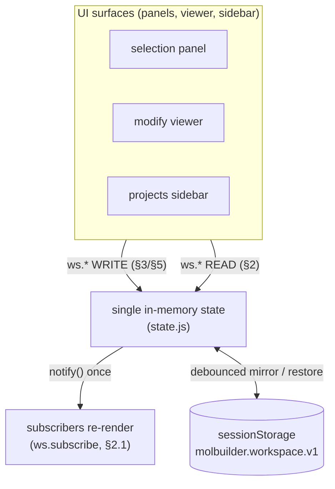

# The workspace state layer — a developer's guide

**What this is.** A plain-language guide to the client-side **workspace store**:
the one shared piece of state behind the Molbuilder / Modify tab (structure,
atoms, selection, view, dirty-flag), the `ws.*` API you use to read and change
it, how it persists across navigation, and — importantly — the **rules a
caller must honor** so you don't reintroduce the class of bugs this layer is
prone to.

**What this is NOT.** The authoritative contract. For exact return shapes,
error semantics, and test-pinned clauses, `protocols/workspace-contract.md`
is the sole source of truth; this guide teaches and points there.
`protocols/workspace-contract.md` **molview-module.md** covers the MolView module (viewer +
atom-selection + k-grid) in depth; `archive/2026-07-06-workspace-state.md` is the
history behind the design.

---

## 1. The one-paragraph mental model

There is **one** in-memory workspace state (structure + per-atom rows +
selection + view + dirty-flag). Every UI surface **reads it and changes it
only through the `ws.*` API** (`window.molbuilder.workspace`). Each change
fires `notify()` once; subscribers re-render. The state is mirrored to
`sessionStorage` so it **survives navigating between tabs**, and is
**restored on mount**. That's it — one state, one API, one persistence key.



**Golden rule:** never touch `selection.store`, `structureCanvas`, or the
modify-tab internals directly — always go through `ws.*`. That single
choke-point is what keeps every surface consistent.

---

## 2. The pieces (where things live)

| File | Role |
|---|---|
| `lib/workspace/dispatcher.js` | **the `ws.*` facade** — assembles the API every surface calls |
| `lib/workspace/_selection-store-impl.js` | the selection/atoms store (async mutators, HTTP fetches) |
| `lib/workspace/_canvas-state-impl.js` | the canvas/structure + dirty-flag store |
| `modify/viewer.js` | the Modify tab; `restoreModifyState()` hydrates from the snapshot on mount |
| `modify/selection-bootstrap.js` | Modify-tab page glue (sidebar wiring, Load button, mount seeding) |

The facade is important: **all writers funnel through the dispatcher**, so it
is the place contracts are enforced and the place to look when state goes
wrong.

---

## 3. The API cheat-sheet

**Read** (`ws.*`, all synchronous, see contract §2):

| Call | Gives you |
|---|---|
| `ws.getStructure()` | `{text, source_format, title, n_atoms, atoms, lattice}` or `null` if empty |
| `ws.getSelection()` | `{indices, mode, filters, combinator}` (indices sorted, unique) |
| `ws.getAtoms()` | the per-atom rows (hot path for panels/pickers) |
| `ws.getSourceFile()` | the loaded file path, or `null` |
| `ws.isDirty()` / `ws.isEmpty()` | unsaved-edits / nothing-loaded |
| `ws.getState()` | the whole atomic snapshot (use sparingly) |
| `ws.mountRestoreTarget()` | **the file a mount restore will own** — see §5 |
| `ws.readPersistedSnapshot()` | the raw persisted snapshot (or `null`) |

**Change** (see contract §3/§5):

| Call | Does |
|---|---|
| `ws.selection.set/add/remove/toggle/all/invert/clear(...)` | local selection edits (no HTTP), each fires `notify()` once |
| `ws.applyOp(op, args)` | run a modifier op (delete/add…) over HTTP; replaces structure; pushes undo |
| `ws.adoptSession({sourceFile, selection, atoms})` | install a loaded session (atoms + selection) — the restore/load path |
| `ws.installStructure(struct, source)` | put a structure into the canvas (dirty-aware) |

**Subscribe:** `const off = ws.subscribe(fn)` → `fn(snapshot)` on every change;
call `off()` to unsubscribe.

---

## 4. Persistence & restore (plain language)

- The whole workspace is mirrored (debounced) to **one** sessionStorage key,
  `molbuilder.workspace.v1` (contract §4.1).
- On page mount, `viewer.js::restoreModifyState()` reads that snapshot and
  rehydrates **structure + selection + camera + chrome**.
- Transient fields (`loading`, `inFlight`, `error`, `history`) are **not**
  persisted — restoring them would be wrong.

---

## 5. The one rule every mount-time caller MUST honor

This is the gotcha that has bitten this layer repeatedly (BOMB-0/2, the "MUST
await" / "selector tracks the old file" fixes, and the 2026-07-01 selection
race). Read it before you write any code that loads on mount.

> **On page mount, the snapshot restore is the SOLE authority for hydrating
> the workspace.** If your surface *also* wants to load a file on mount, first
> call **`ws.mountRestoreTarget()`**. If it returns the same file you were
> about to load, **defer** — the restore already owns it. Only load a file the
> snapshot does *not* own (a genuine new/cross-tab structure).

```js
const target = ws.mountRestoreTarget();        // file the restore owns, or null
if (isLoadableStructure(file) && file !== target) {
    ws /* … */ commit(file);   // OK: snapshot doesn't own this file
} else {
    // DEFER: restoreModifyState will hydrate it (with its selection).
}
```

**Why:** the store is shared + async with last-writer-wins. Two surfaces both
loading the same file on mount race; a fresh-load carries `selection:[]`, so
when it lands after the restore it **silently wipes the restored selection**.
`mountRestoreTarget()` is order-independent (it reads the same snapshot the
restore uses), so you don't need to know who ran first. Full contract:
`workspace-contract.md` §4.5.

*Live* user actions (a sidebar dblclick, the Load button) are **not** gated —
those are explicit intent and must load.

---

## 6. Common gotchas / anti-patterns

- **Don't** read/write `selection.store` or `structureCanvas` directly — go
  through `ws.*` (contract "how to use", rule 1).
- **Don't** issue a competing mount-time load without checking
  `mountRestoreTarget()` (§5).
- **Do** `await` the async mutators (`adoptSession`, `applyOp`, `setSourceFile`)
  when a subsequent read/click depends on their result — otherwise you read
  the *previous* session's state (the "selector keeps tracking the old file"
  class).
- **Do** subscribe for updates rather than polling `getState()` in a loop.

---

## 7. Where the authority lives

- **`protocols/workspace-contract.md`** — the contract: exact `ws.*` shapes,
  persistence, the mount-restore ownership rule (§4.5), test IDs.
- **`protocols/molview-module.md`** — the MolView module (viewer +
  atom-selection + k-grid + measurement) in depth.
- **`archive/2026-07-06-workspace-state.md`** — the history / why behind the design.
- **`protocols/web-api.md`** — the HTTP shapes the store consumes.
